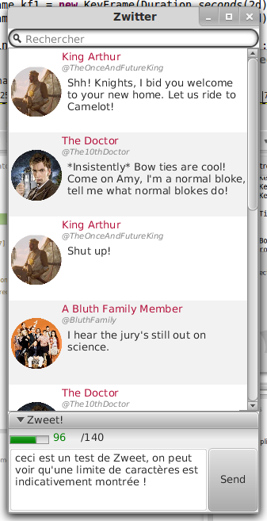

    <h1 style="position:absolute; top: 33%; width:100%; text-align: center;">Formation JavaFX 8</h1>
    <h1 style="position:absolute; top: 50%; width:100%; text-align: center;">Travaux Pratiques</h1>
    

# Avant-propos

Nous allons créer une application nommée Zwitter qui a pour but d'afficher des « zweets » un peu à l'image d'un client twitter avec des tweets.

Le but est évidemment de se familiariser avec les API JavaFX mais aussi de comprendre la démarche de création d'écran riche.

L'application Zwitter reçoit périodiquement des zweets via une API fournie qui ne se sera pas détaillée ; elle permettra aussi de saisir des messages dans une timeline.

Ces travaux pratiques ne sont pas spécifiques à un IDE et peuvent donc être réalisés sous Eclipse ou Intellij selon l'envie.

# Pré-requis

## Installation de Java 8

- Installateurs de JDK 8 (32 ou 64 bits suivant parc machines) pour Windows sur le site d'Oracle
  - http://www.oracle.com/technetwork/java/javase/downloads/index.html

- Facultatif: Installation des exemples et démos Java

## Installation de l'IDE (Eclipse)

- Installateurs de e(fx)clipse 32 et 64 bits pour Windows: 
  - http://www.eclipse.org/efxclipse/index.html (lien sur eclipse.org)
  - http://efxclipse.bestsolution.at/install.html (kit d'install all-in-one)

- Facultatif: installation de IntelliJ (community edition)
  - https://www.jetbrains.com/idea/#chooseYourEdition
  
## Outils annexes : SceneBuilder, ...

- Installateur de SceneBuilder 8.x pour Windows sur le site de Gluon
  - http://gluonhq.com/open-source/scene-builder/

- Facultatif: récupération de ScenicView
  - http://fxexperience.com/scenic-view/

## Récupérer les TPs 

- Récupérer *tp.zip*

